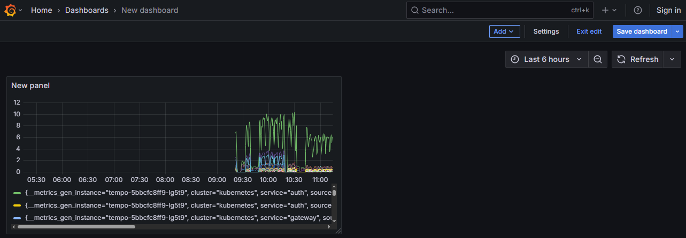

# Grafana の使い方 <!-- omit in toc -->

`http://IP アドレス:3000` で Grafana にアクセスできます

左側に Grafana のメニューが表示されます  
このうち、今回利用するのは `Home`, `Dashboards`, `Explore` の 3 つです


- [Home](#home)
- [Dashboard](#dashboard)
  - [Dashboard の作成](#dashboard-の作成)
  - [パネルの追加・編集](#パネルの追加編集)
- [Explore](#explore)
  - [Search](#search)
  - [TraceQL](#traceql)
  - [Service Graph](#service-graph)

## Home

`Home` をクリックすると、事前に用意したダッシュボードが開きます


## Dashboard

`Dashboard` には事前に用意したダッシュボード demo のみがあります


### Dashboard の作成

右側の `New` ボタン、もしくは画面上部右側の `+` マークをクリックし、New dashboard から作成できます

    


New dashboard をクリックし `Add visualization` ボタンをクリックします


データソースは VictoriaMetrics を選択してください


Edit panel 画面に来たら、いったん保存しておきましょう  
右上の `Save dashboard` をクリックします


名前や保存場所はどこでもよいです


### パネルの追加・編集

ダッシュボードにパネルを追加していきましょう  
`Edit` ボタンを押し、`Add`, `Visualization` とクリックします

  


パネル編集画面にてクエリを入力します  
入力欄が表示されない場合、`Code` をクリックしてください


クエリ入力後、`Back to dashboard` を押して問題ありません  
ダッシュボードに同じようなグラフが表示されていることを確認します

問題なければダッシュボードを保存しておきましょう

  


パネルの上にマウスカーソルをのせると、パネルの右上に `...` が表示されます  
クリックして `Edit` から編集ができます


## Explore

Explore 画面を開くと `Search`, `TraceQL`, `Service Graph` を選択できるような画面が表示されます


### Search

OpenTelemetry のトレースを検索できる画面です  
例えば Service Name: webapp, Span Name: 'GET /api/flavors' で検索し、表示された結果の TraceID をクリックしたものが以下の画面です


結果には、Search で入力したものを含むトレースが表示されます  
TraceID をクリックすることで、そのトレースの詳細が表示されます

### TraceQL

TraceQL というフォーマットでクエリを書いて検索ができます  
例えば上記の Search で検索したものと同じ内容は以下のように書けます

```traceql
{resource.service.name="webapp" && name="GET /api/flavors"}
```

### Service Graph

Service Graph では OpenTelemetry のデータを使って見えるサービスの構成をグラフで見ることができます  
今回のアプリケーションは gateway, auth, webapp, db の 4 つからなることが分かります


円の色はリクエストの成功率、失敗率を表しており、ぱっと見でどれくらいエラーが発生しているか確認することもできます
