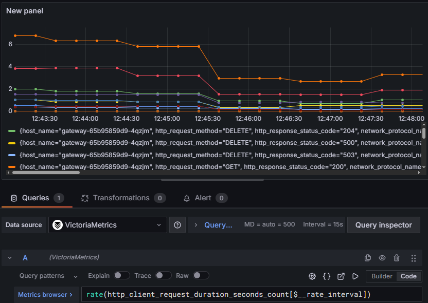

# グラフの作成 <!-- omit in toc -->

Grafana でグラフ作成の手順や Prometheus クエリ (VictoriaMetrics クエリ含む) の書き方ついて、順を追って記載します  
クエリだけ知りたい場合 [グラフ, クエリ対照表](./graph_query_mapping.md) を見てください

- [はじめに](#はじめに)
  - [メトリクス](#メトリクス)
  - [Prometheus 関数](#prometheus-関数)
    - [rate](#rate)
    - [sum](#sum)
    - [running\_sum](#running_sum)
    - [histogram\_quantile](#histogram_quantile)
- [表示期間内の合計リクエスト数のグラフ作成](#表示期間内の合計リクエスト数のグラフ作成)
- [SLI: リクエスト成功率のエラーバジェットグラフの作成](#sli-リクエスト成功率のエラーバジェットグラフの作成)
- [ヒートマップグラフの作成](#ヒートマップグラフの作成)

## はじめに

### メトリクス

今回の Grafana, Tempo, VictoriaMetrics 構成において、利用できるメトリクスは以下のようなものがあります

- http_client_request_duration_seconds_bucket
- http_client_request_duration_seconds_sum
- http_client_request_duration_seconds_count
- http_server_request_duration_seconds_bucket
- http_server_request_duration_seconds_sum
- http_server_request_duration_seconds_count
- traces_spanmetrics_calls_total
- traces_spanmetrics_latency_bucket

このうち、`traces_spanmetrics` から始まるものは OpenTelemetry の span から生成されたものです

これ以外にもメトリクスは存在します  
グラフを作成画面にて、データソースを VictoriaMetrics を選択し Builder モードに設定、Metrics 欄から選択できます


### Prometheus 関数

利用する関数は適宜説明をいれます  
ここではざっくり紹介します

主に利用するのは以下の 4 種類かなと思います

- rate
- sum
- running_sum
- histogram_quantile

#### rate

> rate(v range-vector) calculates the per-second average rate of increase of the time series in the range vector.

`rate` 関数を使ったクエリは以下のように書きます  
このクエリの場合、5 分平均のリクエスト数からどれくらい増えているかを求められます

```promql
rate(http_requests_total{job="api-server"}[5m])
```

`[5m]` としている部分には以下の 3 種類の変数も使えますが、rate 関数を使うときは $\_\_rate_interval を使うとよいです

> https://grafana.com/docs/grafana/latest/datasources/prometheus/template-variables/#use-__rate_interval  
> Grafana recommends using $**rate_interval with the rate and increase functions instead of $**interval or a fixed interval value

- $\_\_range
- $\_\_interval
- $\_\_rate_interval

#### sum

`sum` 関数はよく rate と組み合わせて利用されます  
例えば以下のクエリの場合、各データポイントは過去 5 分間のリクエスト数となります

> Grafana, Prometheus における sum は 複数データを束ねる (集約) という意味だと思っています  
> 例えば http_request_total のデータが HTTP メソッド毎に分かれている場合、sum をすることで、ひとまとめにできる、という意味です

```
sum(rate(http_requests_total{job="api-server"}[5m]))
```

このほかにも `sum by` とすることで、ラベル毎の合計値を求めることもできます  
以下は job というラベルの値ごとのリクエスト数が求められます

```
sum by (job) (rate(http_requests_total[5m]))
```

#### running_sum

VictoriaMetrics には `running_sum` という関数があり、累積値を求められます

#### histogram_quantile

今回は `histogram_quantile` は主にレイテンシのパーセンタイルを求める際に使います  
メトリクスは `_bucket` で終わるものを選択します

以下はレイテンシの 90 パーセンタイル値を求める際のクエリ例です

```
histogram_quantile(0.9, sum by (le) (rate(http_request_duration_seconds_bucket[$__rate_interval])))
```

ここでの `le` は `less than or equal to` の略です  
`_bucket` で終わるメトリクスにはこの `le` が含まれおり、どの程度のレイテンシのリクエストが、どれくらいあったかを表しています  
例えば以下の表のような場合、0.2 秒以下のリクエストは 3 件, 0.4 秒以下は 4 件なため、0.2 ~ 0.4 のリクエストは 1 件ある、といったことが分かります

| le   | count |
| ---- | ----- |
| +Inf | 7     |
| 1    | 5     |
| 0.8  | 4     |
| 0.6  | 4     |
| 0.4  | 4     |
| 0.2  | 3     |

## 表示期間内の合計リクエスト数のグラフ作成

メトリクスの内、リクエスト数を求めるには以下の 3 つが使えそうです

- http_client_request_duration_seconds_count
- http_server_request_duration_seconds_count
- traces_spanmetrics_calls_total

ここでは http_client_request_duration_seconds_count を使ってみます  
まずはメトリクスのみを入力してグラフを表示してみます


> http_client_request_duration_seconds_count

桁数が大きく、ほぼ 1 直線のグラフが表示されました  
表示期間を変えても値が変わりません  
また、ラベルの値が異なるそれぞれの線が引かれていることも分かります

- http_client_request_duration_seconds_count は計測を開始してから現在までのリクエスト数になっていそう
- HTTP メソッドやステータスコード毎に回数がカウントされている

表示期間におけるリクエスト数を求めるため、`rate` や `sum` を使ってクエリを修正します

まずは `rate` 関数を使って、平均リクエスト数を出します



> rate\(http_client_request_duration_seconds_count\[$\_\_rate_interval])

次に `sum` 関数を使って合計値を求めます


> sum\(rate\(http_client_request_duration_seconds_count\[$\_\_rate_interval]))

これで完成！、でいいでしょうか ...  
現在グラフに表示されているのは、リクエスト数の遷移であり、表示期間中の合計リクエスト数ではなさそうです  
リクエスト数の累積値を求める `running_sum` を使ってみましょう


> running_sum\(sum\(rate\(http_client_request_duration_seconds_count\[$\_\_rate_interval])))

いい感じです  
表示期間を 5m, 15m, 30m と変えてみても単調増加のグラフとなっており、累積値が求められていそうです

最後にグラフタイプを Stat に変更して数字が表示されるようにしましょう


## SLI: リクエスト成功率のエラーバジェットグラフの作成

例えば SLO を、SLO 期間中の成功するリクエストの割合が 99% 以上とする場合、エラーバジェット (エラー許容量) は `100% - SLO%` なため 1% となります
エラーバジェットグラフで表現したいことは、SLO 期間中に起きるエラー数が 1% 以内に収まっていること、残りのエラーを許容できる割合がどれほどかが分かることです

> 実際の成功率に合わせて SLO を設定してください

上記の [ 合計リクエスト数グラフ作成 ](#表示期間内の合計リクエスト数のグラフ作成) で求めた総リクエスト数はそのまま使えそうです  
ここでは成功したリクエスト数はステータスコードが 200 系のみを対象にしてグラフを作ってみます


それぞれのクエリを `+ Expression` より式に渡すことができます

## ヒートマップグラフの作成

http_client_request_duration_seconds_bucket や http_server_request_duration_seconds_bucket には le というラベルがあります  
ここに N 秒以下のリクエスト数が入っています  
どのレイテンシ帯に多くのリクエストがあるのかをヒートマップグラフを使って表現してみましょう

利用するクエリは以下のようなものを使います

```
sum by (le) (rate(http_client_request_duration_seconds_bucket[$__rate_interval]))
```

- Y Axis > Unit を seconds(s) にする
- Colors > Scheme を Spectral にする

などありますが、クエリオプションの Legend, Format を変えることも重要です


