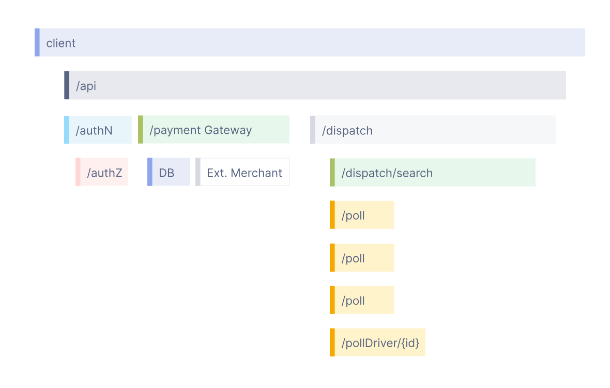

# OpenTelemetry とは

> 実際は色々ありますが、ここではトレースの説明を主にします  
> https://opentelemetry.io/docs/concepts/signals/traces/

OpenTelemetry はアプリケーションを実行する際の動作に関連するデータを集め、処理するツールです  
収集するデータは`メトリクス`, `トレース`, `ログ` などがあります

- メトリクス
  - アプリケーションや OS 等の実行基盤などで定期的に取得されるデータ
  - CPU 使用率、時間当たりのリクエスト数(リクエストレート) など
- トレース
  - アプリケーションにリクエストが届いて、レスポンスを返すまでに行われる内部通信を記録したもの
  - DB 読み書き、別サービスへのリクエストなど
- ログ
  - アプリケーションが出力するメッセージ
  - トレースと組み合わせることで、便利になる

## Span とは

OpenTelemetry のトレースには `Span` というものが登場します



> https://opentelemetry.io/docs/concepts/observability-primer/  
> この図の四角の枠がスパンにあたる

OpenTelemetry において、リクエストを受け取った/送信したイベントはスパンと表現されます  
画像の四角の枠はリクエストの送受信などを意味しています

例えば `GET /api` というリクエストを受信し、結果が問題なかった場合以下のような json が記録されることになります

```json
{
  "traceId": "5b8aa5a2d2c872e8321cf37308d69df2",
  "spanId": "051581bf3cb55c13",
  "parentSpanId": "051581bf3cb55c13",
  "name": "GET /api",
  "kind": "SPAN_KIND_SERVER",
  "status": {
    "code": 0
  }
}
```

### kind

Span はリクエストの送信/受信を表しています  
リクエストを受信した (サーバ側だった) ら `Server`, リクエストを送信した (クライアント側だった) ら `Client` となります

他にも `Producer`, `Consumer`, `Internal` があります  
`Producer`, `Consumer` はメッセージキューへの送受信のような非同期的処理の場合に使われ、`Internal` は関数実行など通信を行わない場合に使われるようです  
今回のアプリケーションには使っていません

### status

Span にはステータスがあります  
デフォルトは `Unset` で成功を意味します  
エラーが起きたら `Error` で、明示的に問題なしとしたい時に `Ok` とします

- Unset
- Ok
- Error

なにをエラーとするかは OpenTelemetry データを解釈するアプリケーションによって異なります  
今回の Grafana で検索できるデータは 400 系、500 系エラーがすべて Error となっています
