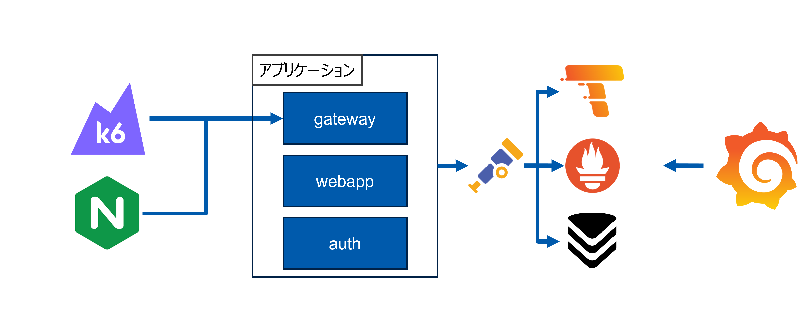

# サービス構成

## 全体構成

Grafana, Prometheus 等を含めた全体の構成です

- k6
  - 負荷テスト、パフォーマンステスト等で用いられるツールです
  - 設定した通りにリクエストを送信することができるため、利用しています
- Nginx
  - 外部からアクセスするときは Nginx を通してアプリケーションにリクエストが届きます
- Otel Collector
  - アプリケーションに計装した OpenTelemetry データを Otel Collector で集めます
  - その後 Tempo, Prometheus, VictoriaMetrics に送信しています
- Tempo
  - Grafana と連携することで Service Graph が表示できるらしい、と見て導入しています
  - 結果 traces_spanmetrics 系のメトリクスが使えるようになりました
- VictoriaMetrics
  - Prometheus 互換の時系列データベースです
  - 時間方向の合計 (累積値, running_sum) が Prometheus では出来なさそうだったので、使うことにしました
- Prometheus
  - Prometheus を使うと Service Graph でエラー率がぱっと見で分かるのため、残しています
- Grafana
  - OSS なグラフ描画ツールといえば Grafana ! と思い使っています
  - Grafana 社製ツール (k6, Tempo 等) との連携もできとても便利です

## OpenTelemetry の測定対象の構成

OpenTelemetry の測定対象、という観点で登場するサービスは以下の 3 つです

- gateway
- auth
- webapp

### gateway

アプリケーションへのリクエストは必ず gateway を経由するようにしています  
リクエストによって、トークン発行やトークン検証の実施、またはそのまま通過させるなどします

### auth

トークンの発行、検証をするサービスです  
Auth という名前ですがユーザ認証などはしていません

### webapp

Go の kubernetes クライアントである client-go を使って kubernetes を操作するアプリケーション本体です

### db

MySQL データベースです  
DB 自体を OpenTelemetry 計装しているわけではなく、webapp を計装したことで Service graph に表示されています
